# Green_Mart 🛒

Green_Mart is a comprehensive Flutter-based e-commerce application designed to provide users with a seamless and intuitive shopping experience. It features user authentication, a wide range of products categorized for easy exploration, an interactive cart system, and profile management capabilities.

## ✨ Features

*   **User Authentication**: Secure login, sign-up, and verification using phone number.
*   **Home & Explore**: Discover products easily from the home page or browse categories in the dedicated explore section.
*   **Search**: Find specific items quickly with the robust search functionality.
*   **Product Details**: View comprehensive details, images, and ratings for individual products.
*   **Shopping Cart**: Manage your desired items, adjust quantities, and proceed to a streamlined checkout process.
*   **Favorites**: Save your favorite products for quick access later.
*   **Profile Management**: Manage user details, track orders, and configure settings.

## 🛠️ Tech Stack & Dependencies

Built with **Flutter** (SDK: ^3.10.4).

*   `cupertino_icons`: ^1.0.8 - iOS style icons.
*   `flutter_svg`: ^2.2.3 - SVG image rendering.
*   `pinput`: ^6.0.2 - Pin code input fields for verification.
*   `flutter_rating_bar`: ^4.0.1 - Rating bar for product reviews.
*   **Fonts**: Custom `Poppins` font family for typography.

## 📱 Screenshots

<p align="center">
  
  
  
  
  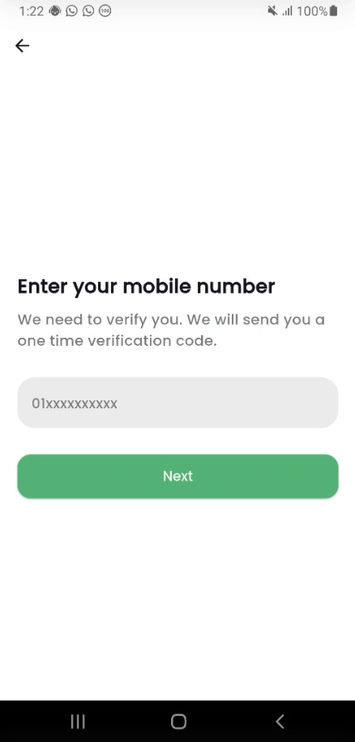
  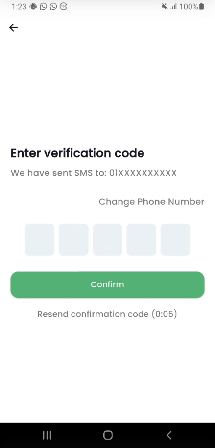
  
  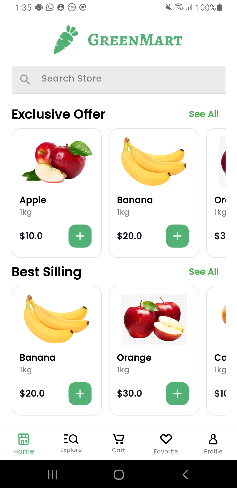
  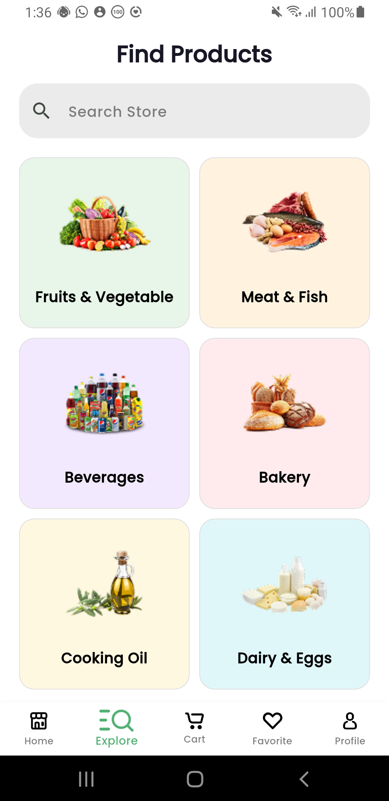
  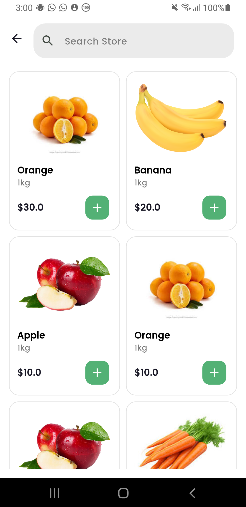
  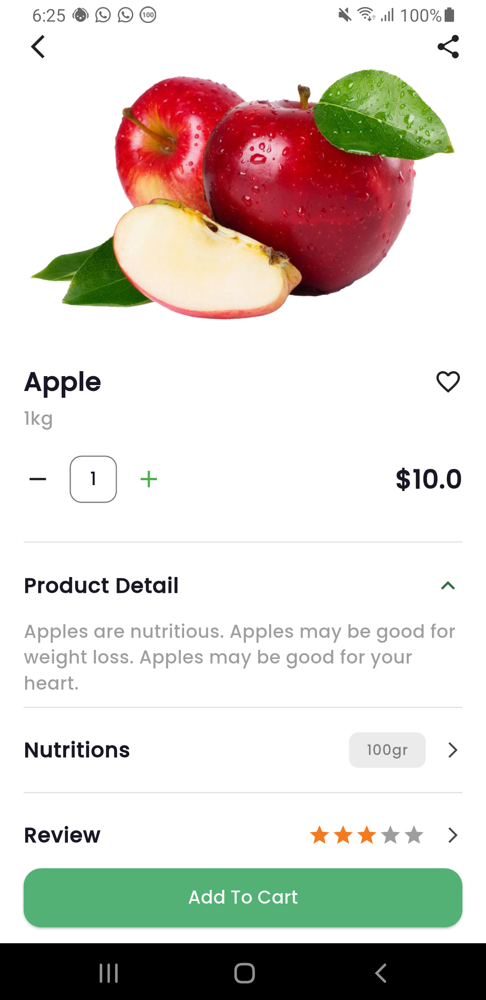
  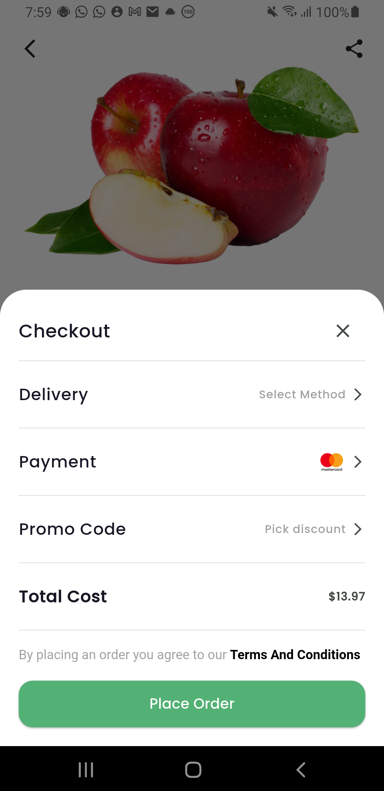
  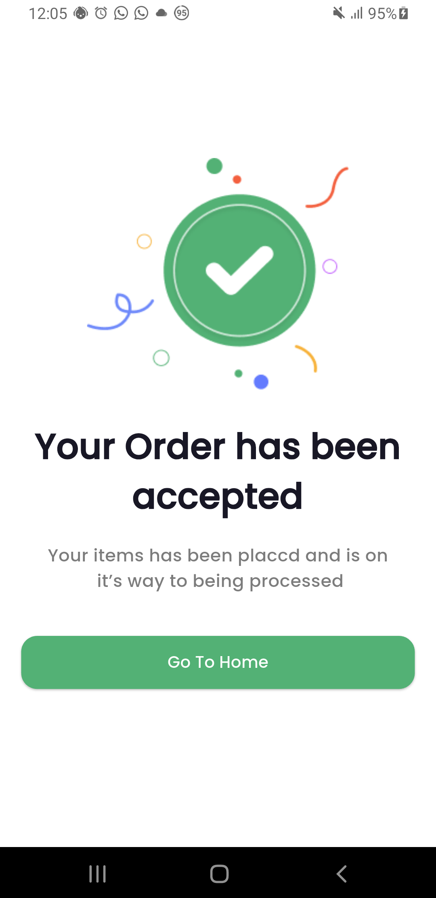
  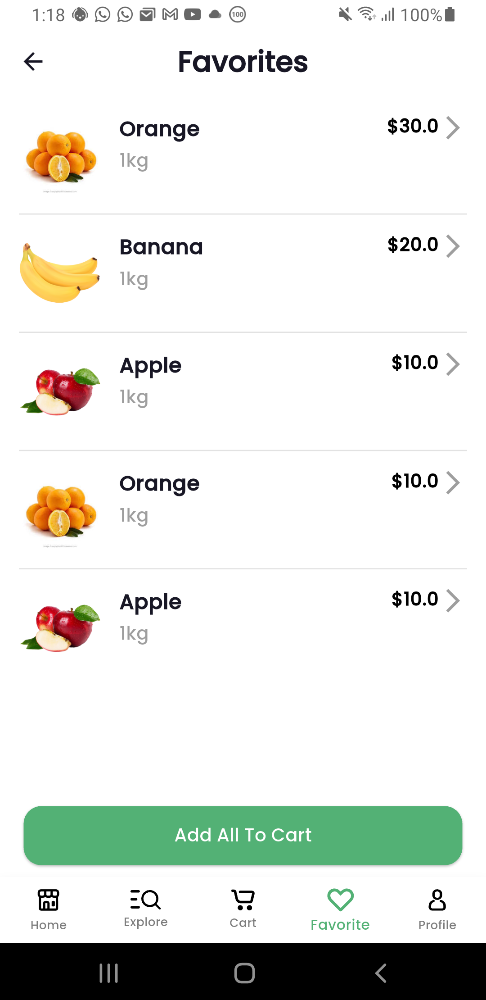
  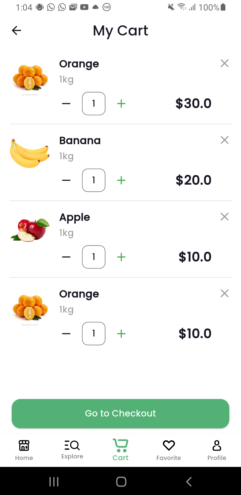
  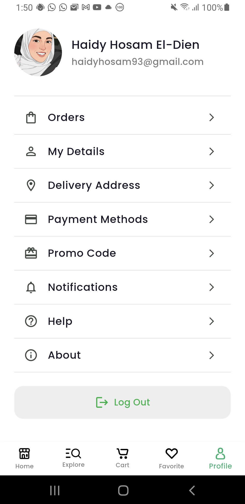
</p>

## 🚀 Getting Started

### Prerequisites

*   Flutter SDK (^3.10.4)
*   Dart SDK
*   Android Studio / VS Code with Flutter extensions installed.

### Installation

1.  Clone the repository:
    ```bash
    git clone https://github.com/yourusername/green_mart.git
    ```
2.  Navigate to the project directory:
    ```bash
    cd green_mart
    ```
3.  Install dependencies:
    ```bash
    flutter pub get
    ```
4.  Run the app:
    ```bash
    flutter run
    ```

## 📂 Project Structure

*   `lib/Core`: Contains core utilities, themes, constants, and shared components.
*   `lib/Features`: Divided into feature-specific modules:
    *   `auth`: Authentication flow (Login, SignUp, Verification).
    *   `Home`: Main landing screens.
    *   `Explore`: Browsing by categories.
    *   `Search`: Search interface and logic.
    *   `Details`: Product detail views.
    *   `My Cart`: Cart and checkout flow.
    *   `Favorites`: Wishlist management.
    *   `Profile`: User profile settings and info.

